<!-- Generated by crest.py via build_readme.py. -->

<a href="#profile">PROFILE</a> · <a href="#stack">STACK</a> · <a href="#projects">PROJECTS</a>

<a href="./assets/crest/hero-film.mp4"><picture><source media="(prefers-reduced-motion: reduce)" srcset="./assets/crest/hero-still.webp"/></picture></a>

<a href="./assets/crest/hero-film.mp4">▶ WATCH FILM · MP4</a>



<a href="https://github.com/EXID-Developer"></a>
<a href="https://github.com/EXID-Developer?tab=repositories"></a>
<a href="https://github.com/EXID-Developer?tab=stars"></a>

소개 · 기술 스택 · 링크를 텍스트로 보기

**EXID — Software Developer**

Java와 Spring으로 서버를 세우고, React로 화면을 그리며, Spring AI로 새로운 가능성을 실험합니다.

- **Backend:** Java · Spring Boot · MyBatis
- **Frontend:** TypeScript · React · Vite
- **AI & Tools:** Spring AI · Git
- [GitHub](https://github.com/EXID-Developer) · [Repositories](https://github.com/EXID-Developer?tab=repositories) · [Stars](https://github.com/EXID-Developer?tab=stars)

<a href="https://streak-stats.demolab.com?user=EXID-Developer"></a>

Contribution trail

<a href="https://github.com/EXID-Developer/damso"></a> <a href="https://github.com/EXID-Developer/SpringAiBasic"></a>

<a href="https://github.com/EXID-Developer/sivertown"></a> <a href="https://github.com/EXID-Developer/SpringBootMyBatis"></a>

<a href="https://github.com/EXID-Developer/SpringAiBasic">공부 기록</a> · <a href="https://github.com/EXID-Developer/damso">진행 중인 프로젝트</a>

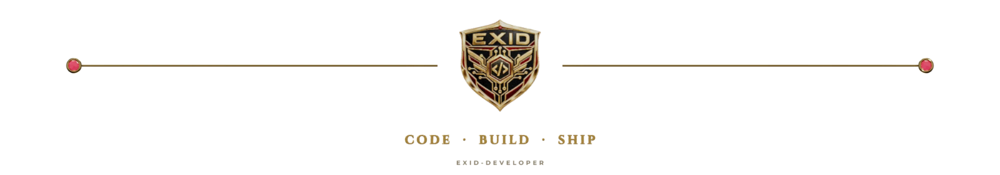

    

<a href="./CREDITS.md">Credits · 이미지 출처</a> · <a href="./CREST_THEME.md">Crest 테마 제작 방식</a>

Theme switch: 저장소 소유자가 이슈를 제출하면 테마가 변경됩니다.

