## ✦ 날개를 펼친 개발자, exid

> 빛의 땅 엘리시움에서 첫 코딩 이야기를 써 내려가는 중입니다.
> Java와 Spring으로 서버를 세우고, React로 화면을 그리며, Spring AI로 새로운 가능성을 실험합니다.

## ✦ 장비 (Tech Stack)

  
  
  
  
  
  
  
  

## ✦ 전투 기록 (GitHub Stats)

  

  

## ✦ 비행 궤적 (Contribution Snake)

  

## ✦ 대표 퀘스트 (Featured Projects)

  
  

  
  

  
   ✦ 빛이 당신의 길을 비추기를 ✦

