## ▌ 사이버 공간의 개발자, exid

> 네온이 켜진 사이버 공간에서 코드를 쓰는 중입니다.
> Java와 Spring으로 서버를 세우고, React로 화면을 그리며, Spring AI로 새로운 가능성을 실험합니다.

## ▌ LOADOUT // Tech Stack

  
  
  
  
  
  
  
  

## ▌ SYSTEM LOG // GitHub Stats

  

  

## ▌ DATA STREAM // Contribution Snake

  

## ▌ ACTIVE MISSIONS // Featured Projects

  
  

  
  

THEME SWITCH (owner only: opens an issue, submit it and the profile re-renders) 
  
  
  

// END OF TRANSMISSION

