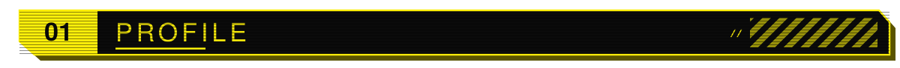
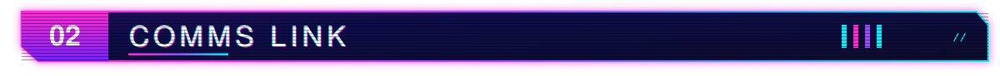
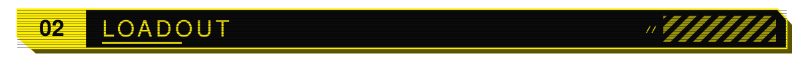
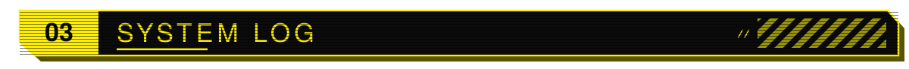
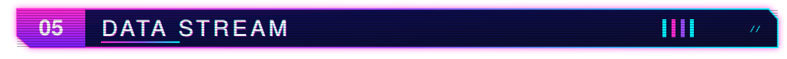
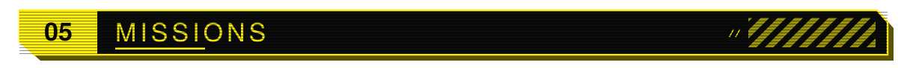

<h3 align="center">"Think with your code!"</h3>

네온이 켜진 사이버 공간에서 코드를 쓰는 중입니다. 
Java와 Spring으로 서버를 세우고, React로 화면을 그리며, Spring AI로 새로운 가능성을 실험합니다.

  
  
  

<b>Tech Stack (click to fold)</b>

 

  
  
  
  
  
  
  
  

<table align="center">
<tr>
<td align="center">
  
</td>
<td align="center">
  
</td>
</tr>
</table>

  

  
  

  
  

공부 기록이 궁금하다면 &gt;&gt;  
진행 중인 프로젝트가 궁금하다면 &gt;&gt; 

THEME SWITCH (owner only: opens an issue, submit it and the profile re-renders) 
  
  
  

