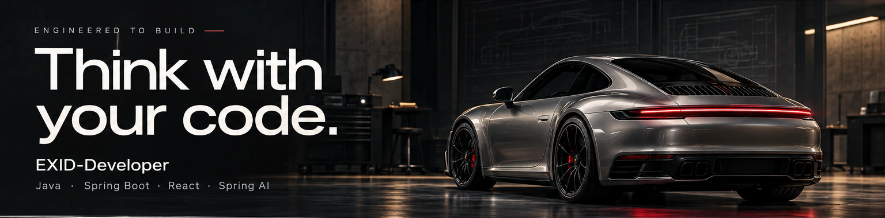

<!-- Generated by porsche.py via build_readme.py. -->

<a href="#profile">PROFILE</a> · <a href="#projects">PROJECTS</a> · <a href="#stack">STACK</a>

<table width="100%"><tr>
<td width="66%" valign="top"></td>
<td width="34%" valign="top">
 
 
 
 

</td>
</tr></table>

소개 · 기술 스택 · 링크를 텍스트로 보기

**Think with your code! — EXID-Developer**

Java와 Spring으로 서버를 세우고, React로 화면을 그리며, Spring AI로 새로운 가능성을 실험합니다.

- **Backend:** Java · Spring Boot · MyBatis
- **Frontend:** TypeScript · React · Vite
- **AI & Tools:** Spring AI · Git
- [GitHub](https://github.com/EXID-Developer) · [Repositories](https://github.com/EXID-Developer?tab=repositories) · [Stars](https://github.com/EXID-Developer?tab=stars)

### Activity

Contribution trail

### Featured projects

 

 

[공부 기록](https://github.com/EXID-Developer/SpringAiBasic) · [진행 중인 프로젝트](https://github.com/EXID-Developer/damso)

   

Theme switch: 저장소 소유자가 이슈를 제출하면 테마가 변경됩니다.

